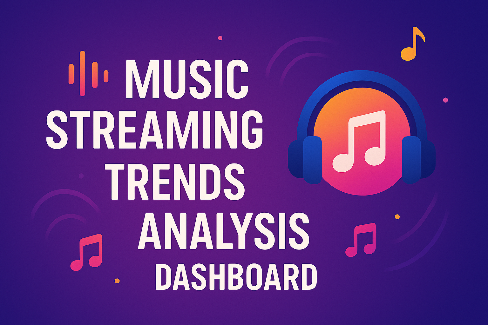

# 🎵 Music Streaming Trends Analysis Dashboard

<div align="center">
  
</div>


[](https://adp7ebd2nzhdfdu3nkvsj2.streamlit.app/)

Last updated: 2025-10-08

## 📋 Project Overview

This project provides a comprehensive analysis of global music streaming trends from 2018-2024, featuring an interactive Streamlit dashboard that transforms complex data insights into actionable business intelligence for the music industry.

### 🎯 Objectives

- Explore global music streaming patterns and user behavior
- Surface trends across demographics, genres, platforms, and countries
- Provide an intuitive, interactive dashboard to communicate findings

## 🏗️ Repository Structure

```
📁 musictrends/
├── 📂 data/                    # Dataset(s)
│   └── Global_Music_Streaming_Listener_Preferences.csv
├── 📂 notebooks/               # Jupyter notebooks for analysis
│   └── music_trends_analysis_clean.ipynb
├── 📂 panel/                   # Streamlit dashboard
│   └── app.py
├── .gitattributes             # Git attributes configuration
├── README.md                  # Project documentation
└── requirements.txt           # Python dependencies
```

## 🔍 Key Features

### 📊 Interactive Dashboard Sections

1. **📈 Dataset Overview**
   - Headline metrics, data shape, and sample composition
   - Platform distribution and top countries by users
   - Data quality cues and quick-glance KPIs

2. **👥 Age-Based Analysis**
   - Individual-age view with generation bands (Gen Z, Millennials, Gen X)
   - Metrics: Minutes/day, Songs Liked, Discover Weekly Engagement (%), Repeat Song Rate (%)
   - Generation insights and variable ranges

3. **🌍 Country Analysis**
   - Country rankings for key metrics with flag annotations
   - Top 5 leaders by metric and sample size transparency
   - Identification of expansion “white spaces”

4. **🎼 Genre Preferences**
   - Top genres overall and by country (interactive grouped bars)
   - Coverage of Top-N and genre diversity indicators
   - Regional preferences for localized content strategy

5. **⏰ Listening Time Analysis**
   - Global distribution (Morning/Afternoon/Night)
   - Breakdown by country and by age/generation
   - Timing recommendations for notifications and releases

6. **📱 Platforms by Generation**
   - Platform preference split across Gen Z, Millennials, Gen X
   - Platform dominance and positioning cues

7. **🗺️ Unified Choropleth Map**
   - Country-level map switchable across quantitative metrics and total users
   - Quick identification of concentration and opportunity zones

8. **📈 Correlation Analysis**
   - Heatmap of numerical variables and strongest pairs
   - Guides for hypothesis generation and A/B test ideas

9. **📈 Statistical Tests (summary in app & notebook)**
   - Non-parametric tests with medians/IQR and effect sizes
   - Clear p-values and compact interpretations

### 🎨 Dashboard Highlights

- **Interactive Visualizations**: Plotly-powered charts with hover effects and zoom capabilities
- **Real-time Filtering**: Dynamic data exploration with multiple filter options
- **Professional Design**: Clean, corporate-ready interface suitable for stakeholder presentations
- **Mobile Responsive**: Optimized for different screen sizes
- **Export Ready**: Charts can be downloaded for presentations

## 🚀 Getting Started

### Prerequisites

- Python 3.10 or higher
- pip package manager

### Installation

1. **Clone the repository**
   ```bash
   git clone https://github.com/jufercar/musictrends.git
   cd musictrends
   ```

2. **Create virtual environment** (recommended)
   ```bash
   python -m venv .venv

   # On Windows
   .venv\Scripts\activate

   # On macOS/Linux
   source .venv/bin/activate
   ```

3. **Install dependencies**
   ```bash
   pip install -r requirements.txt
   ```

4. **Run the dashboard**
   ```bash
   cd panel
   streamlit run app.py
   ```

5. **Open in browser**
   - The dashboard will automatically open at `http://localhost:8501`
   - If not, manually navigate to the URL shown in the terminal


## 📊 Dataset Information

### Data Source
- **File**: `Global_Music_Streaming_Listener_Preferences.csv`
- **Records**: ~5,000 users
- **Time Period**: 2018–2024
- **Geography**: Global coverage across 50+ countries
- **Source**: Kaggle – Global Music Streaming Trends and Listener Insights
   (https://www.kaggle.com/datasets/atharvasoundankar/global-music-streaming-trends-and-listener-insights)

### Key Variables
- **Demographics**: Age, Country
- **Behavior**: Minutes streamed per day, Songs liked, Repeat rate
- **Preferences**: Top genre, Most played artist, Listening time
- **Platform**: Streaming service, Subscription type
- **Engagement**: Weekly engagement, Discovery metrics

## 🔬 Analysis Methodology

### 1. Data Preparation
- Data cleaning and quality checks
- Handling of missing values
- Feature engineering (e.g., age grouping)

### 2. Exploratory Data Analysis
- Univariate and bivariate exploration
- Correlation analysis (Pearson and Spearman)
- Distribution diagnostics (histograms, Q–Q)

### 3. Statistical Testing (non-parametric focus)
- Distribution assessment: Shapiro–Wilk, D’Agostino’s K², Anderson–Darling
- Two groups: Mann–Whitney U test
- Multiple groups: Kruskal–Wallis H-test
- Categorical association: Chi-square test of independence with Cramér’s V
- Reporting: p-values plus effect sizes; medians and IQR preferred over means/SD

## 📈 Key Observations (selected)

### 🎯 User Demographics
- **Age Distribution**: Balanced across generations with slight Millennial dominance
- **Geographic Spread**: Strong representation from North America, Europe, and emerging markets
- **Platform Preferences**: Diverse usage across major streaming platforms

### 🎵 Listening Behaviors
- **Genre Diversity**: Pop, Rock, and Hip-Hop dominate globally with regional variations
- **Temporal Patterns**: Evening listening peaks with generational differences
- **Engagement Levels**: High repeat listening rates indicate strong user loyalty

## 💡 Potential Uses
- Dashboarding and storytelling with interactive charts
- Exploratory analysis to inspire product or marketing hypotheses
- Benchmarking of platforms, genres, and countries in the dataset

## 🛠️ Technical Implementation

### Technologies Used
- **Frontend**: Streamlit (Interactive dashboard)
- **Data Processing**: Pandas, NumPy, SciPy
- **Visualization**: Plotly, Matplotlib, Seaborn
- **Analysis**: Jupyter Notebooks
- **Deployment**: Local server and Streamlit Cloud ready

### Performance Optimizations
- **Caching**: `@st.cache_data` for efficient data loading
- **Lazy Loading**: Progressive chart rendering
- **Memory Management**: Optimized data structures

## 📱 Usage Guide

### Navigation
1. **Sidebar Controls**: Use the left panel to switch between analysis sections
2. **Interactive Charts**: Click, zoom, and hover for detailed information
3. **Variable Selection**: Use dropdowns to explore different metrics
4. **Export Options**: Download charts using Plotly's built-in tools

### Best Practices for Presentations
- Start with the **Overview** section for context
- Use **Age Analysis** to discuss demographic trends
- Highlight **Country Analysis** for global market insights
- Conclude with **Strategic Insights** for actionable recommendations

## 🤝 Contributing

We welcome contributions to enhance the dashboard and analysis!

### How to Contribute
1. Fork the repository
2. Create a feature branch (`git checkout -b feature/amazing-feature`)
3. Commit your changes (`git commit -m 'Add amazing feature'`)
4. Push to the branch (`git push origin feature/amazing-feature`)
5. Open a Pull Request

### Areas for Enhancement
- Additional visualization types
- Advanced statistical analysis
- Machine learning predictions
- Real-time data integration
- Cloud deployment setup

## 📄 License

This project is licensed under the MIT License - see the [LICENSE](LICENSE) file for details.

## 🙋‍♀️ Support

For questions, issues, or suggestions:

- **Issues**: Open an issue on GitHub
- **Discussions**: Use GitHub Discussions for questions

## 🔄 Version History

- **v1.0.0** – Initial release

## 🏆 Acknowledgments

- **Dataset (Kaggle)**: Global Music Streaming Trends and Listener Insights
   https://www.kaggle.com/datasets/atharvasoundankar/global-music-streaming-trends-and-listener-insights/data
   Please credit the dataset author and Kaggle page in any public use.
- **Visualization Libraries**: Plotly team for charting capabilities
- **Streamlit Community**: For the amazing dashboard framework

---

<div align="center">

**🎵 Transform Data into Music Industry Intelligence 🎵**

[View Live Dashboard](https://adp7ebd2nzhdfdu3nkvsj2.streamlit.app/) • [Report Issues](https://github.com/jufercar/musictrends/issues) • [Request Features](https://github.com/jufercar/musictrends/discussions)

</div>